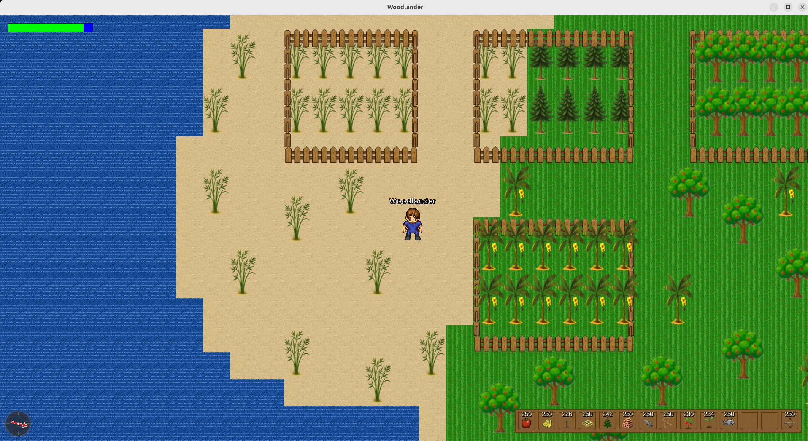

# Woodlanders - A 2D Multiplayer Adventure

## 🌐 [Play Woodlanders - Official Game Homepage](https://gcclinux.github.io/woodlanders/)

## 🎮 The AI-Driven Game Development Story

**Woodlanders** is an ambitious experiment in AI-assisted game development - a fully functional multiplayer 2D adventure game built entirely through conversational AI. This project demonstrates what's possible when human creativity meets AI capabilities: no manual coding, just natural language prompts, specifications, and iterative refinement.

### 🤖 AI Tools Powering This Project

This game was developed using a combination of cutting-edge AI tools, each contributing to different aspects of development:

- **Kiro IDE** (Primary) - The main development environment where most code generation, debugging, and feature implementation occurred through natural language conversations
- **Amazon Q** - AI assistant embedded in Kiro IDE and available as a VSCode extension, providing intelligent code suggestions and assistance
- **GitHub Copilot** - Used within Visual Studio Code IDE for the Woodlanders launcher, leveraging autocomplete and multiple dedicated LLMs
- **Microsoft Copilot & Google Gemini** - AI tools for generating and identifying imagery and object items on sprite sheets, helping create visual assets
- **Antigravity** - The powerful agentic AI coding assistant, using the fast GPT‑OSS model for rapid code generation and iteration or autonomous code generation.

### The Vision: Zero-Code Game Development

The goal was simple yet audacious: **build a complete, enjoyable multiplayer game in Java using only AI prompts and requests**. No direct code writing. No manual debugging. Just describing what we wanted, and letting Kiro AI bring it to life.

---

## 🚀 Quick Start

### Woodlanders Launcher (Recommended)

The easiest way to play Woodlanders is with our auto-updating launcher:

**📥 [Download Woodlanders Launcher](https://github.com/gcclinux/woodlanders-launcher/releases)**

Features:
- ✅ **One-Click Install** - Download and install automatically
- 🔄 **Auto-Updates** - Always get the latest version from source
- 🎮 **Easy Launch** - Start playing with a single click
- 📦 **No Dependencies** - Everything you need is included

For manual installation or building from source, see the **[Installation Guide](docs/INSTALLATION.md)**.

| Help & Issues | Join Discussions and share ideas |
|----------|----------|
|    |  |
| | |

### Build fences around your plantation in Item World --> Press B

*v0.0.30 introduces the fence building system, get item in Item World, then open Fence inventory with "B"!*

### 📸 [More Woodland Screenshots](docs/SCREENSHOTS.md)

---

## 📚 Documentation Index

### Getting Started
- 📖 **[AI Development Story](docs/AI_DEVELOPMENT_STORY.md)** - Learn how this game was built entirely with AI
- 🎯 **[Game Overview](docs/GAME_OVERVIEW.md)** - Features, performance, and network architecture
- 🔧 **[Installation Guide](docs/INSTALLATION.md)** - How to install and run the game
- 🎮 **[Controls](docs/CONTROLS.md)** - Complete guide to game controls and mechanics

### Technical Documentation
- 💻 **[Java Classes](docs/CLASSES.md)** - Code architecture and class structure
- ⚙️ **[Configuration](docs/CONFIGURATION.md)** - Settings and resource configuration
- 🎨 **[Features](docs/FEATURES.md)** - Comprehensive feature list and mechanics
- 📸 **[Screenshots](docs/SCREENSHOTS.md)** - Visual showcase of the game

### Development & Server
- 🗺️ **[Roadmap](docs/ROADMAP.md)** - Completed features and future plans
- 🌐 **[Server Setup](docs/SERVER_SETUP.md)** - Multiplayer server configuration
- 🔥 **[Firewall Configuration](docs/FIREWALL_CONFIGURATION.md)** - Network setup guide
- 🚀 **[All Documentation](docs/README.md)** - Complete documentation hub
